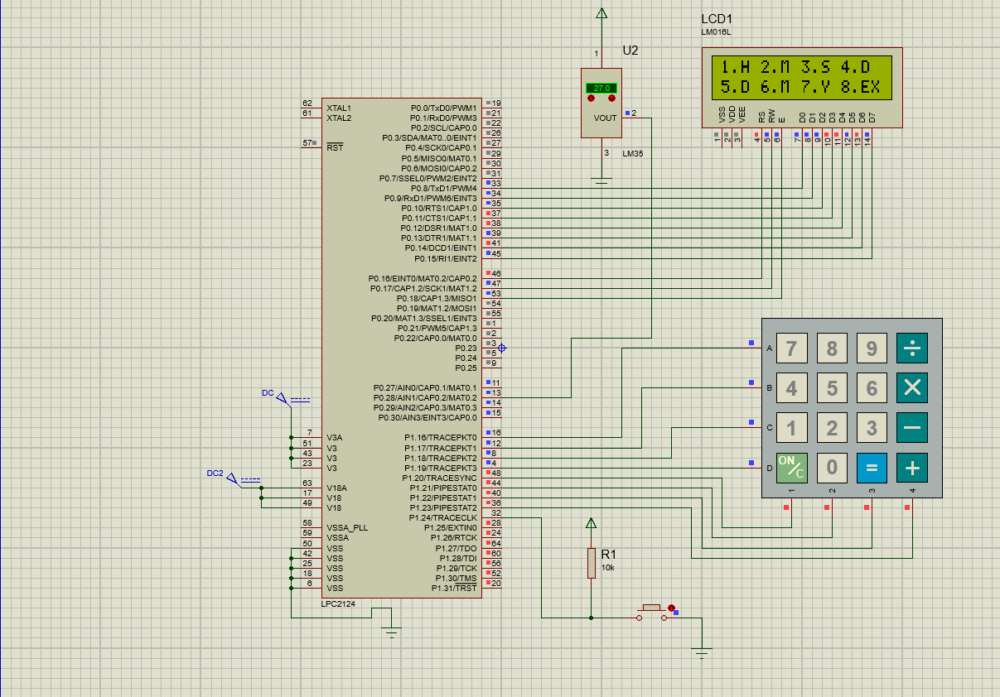

# EventBoard: RTC-Driven Message Display System

##  Overview

The **Event Board: RTC-Driven Message Display System** is an embedded real-time application designed to automate the display of time-based messages using a **Real-Time Clock (RTC)** module. The system continuously keeps track of the current date and time and dynamically displays relevant event messages on an LCD screen whenever a scheduled condition is met.

The core of the system is an ARM-based microcontroller, which coordinates all peripheral operations including **RTC communication, LCD interfacing, keypad input handling, and interrupt management**. The RTC ensures highly accurate timekeeping, which is essential for reliable event scheduling and execution.

Users can create and manage event messages through a simple keypad interface. These events are associated with specific time values, and the system continuously compares the current RTC time with the stored schedule. When a match is detected, the corresponding message is automatically displayed on the LCD without any manual intervention.

The system is designed to operate in real time, making it efficient for environments that require automated reminders or scheduled alerts. It reduces human dependency and ensures that important messages are displayed at the correct time with high accuracy.

This project demonstrates practical implementation of **Embedded C programming, real-time system design, RTC interfacing, LCD display control, keypad handling, and interrupt-driven architecture**. It strengthens understanding of hardware-software integration in embedded systems.

The Event Board can be effectively used in **offices for meeting reminders, schools for timetable alerts, hospitals for patient reminders, and industrial environments for shift scheduling**, making it a versatile and scalable embedded solution.

---

##  Objective

- To design an RTC-based real-time event display system  
- To display scheduled messages based on current time  
- To provide user interaction through keypad  
- To ensure accurate real-time operation using RTC  

---

## Block Diagram

<p align="center">
  
</p>

## Project Images

<p float="left">
  
  
  
</p>

## Demo Videos

  <p float="left">
  
</p>

---
##  Hardware Requirements

- RTC Module (DS1307 / equivalent)  
- LCD Display (16x2)  
- Matrix Keypad  
- ARM Microcontroller (LPC series or equivalent)  
- Power Supply Unit  

---

##  Software Requirements

- Embedded C Programming  
- Keil uVision IDE  
- Flash Magic (for programming)  

---

##  Working Principle

1. RTC continuously maintains current date and time.  
2. System reads RTC time periodically.  
3. Predefined event times are stored in program memory.  
4. Current time is compared with event time.  
5. When a match occurs, the corresponding message is displayed on LCD.  
6. Users can add or modify events using keypad input.  
7. Interrupts ensure smooth and real-time operation.  

---

##  Features

- Real-time clock and calendar display  
- Automatic event message triggering  
- Keypad-based event input system  
- LCD display for time and messages  
- Interrupt-driven operation  
- Simple and reliable embedded design  

---

##  Modules Used

- RTC Interface Module  
- LCD Display Module  
- Keypad Input Module  
- Interrupt Handling Module  
- Event Scheduling Logic Module  

---

## Project Structure

```text
EventBoard-RTC-Driven-Message-Display-System/
│
├── adc.c
├── admin.c
├── delay.c
├── event.c
├── kpm.c
├── lcd.c
├── main.c
├── rtc.c
├── adc.h
├── adc_defines.h
├── admin.h
├── defines.h
├── delay.h
├── event.h
├── kpm.h
├── kpmdefines.h
├── lcd.h
├── lcddefines.h
├── rtc.h
├── types.h
│
├── blockdiagram.png
│
├── images/
│   ├── image1.png
│   ├── image2.png
│   └── image3.png
│
├── videos/
│   └── video.gif
│
└── README.md
```

## Applications

- Office meeting reminders  
- School timetable display systems  
- Hospital reminder systems  
- Industrial shift alerts  
- Digital notice boards  

---

## Future Enhancements

- IoT-based remote scheduling system  
- Mobile application integration  
- Cloud-based event synchronization  
- Voice-controlled event entry system  
- Support for large LED display panels  

---

##  Project Outcomes

- Developed an **RTC-based event display system** using Embedded C  
- Implemented real-time clock interfacing for accurate time tracking  
- Enabled automatic message display based on scheduled time events  
- Integrated keypad for user interaction and event configuration  
- Used interrupt-driven design for efficient and real-time operation  
- Strengthened understanding of RTC, LCD interfacing, and embedded system concepts  

---

##  Conclusion

The **EventBoard: RTC-Driven Message Display System** was successfully designed and implemented using Embedded C. The system efficiently utilizes the RTC module to maintain accurate time and automatically displays scheduled messages on an LCD screen.

The integration of RTC, LCD, keypad, and interrupt handling ensures smooth and reliable operation. The system is simple, efficient, and well-suited for real-time reminder and scheduling applications.

Overall, this project demonstrates strong fundamentals in embedded systems design, RTC interfacing, and hardware–software integration.
