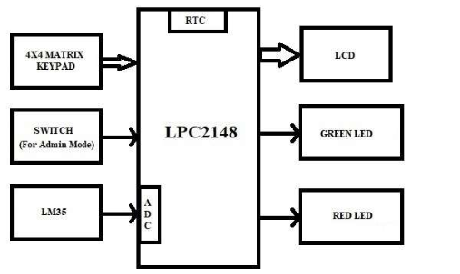

# EventBoard: RTC-Driven Message Display System

##  Overview

- Displays scheduled messages automatically based on real-time clock (RTC) values.
- Developed using an ARM-based microcontroller and Embedded C.
- Uses an RTC module for accurate date and time tracking.
- Allows users to create and manage events through a keypad interface.
- Automatically displays event messages on an LCD when scheduled times are reached.
- Supports real-time operation with minimal user intervention.
- Implements RTC interfacing, LCD control, keypad handling, and interrupt management.
- Demonstrates practical concepts of real-time embedded system design.
- Reduces manual effort by automating reminders and notifications.
- Suitable for offices, schools, hospitals, and industrial scheduling applications.

---

##  Objectives

- To design an RTC-based real-time event display system  
- To display scheduled messages based on current time  
- To provide user interaction through keypad  
- To ensure accurate real-time operation using RTC  

---

## Block Diagram

  

## Project Images And Videos

https://drive.google.com/drive/folders/1Ky_nqXD2Hd60B0cYyf1-Q150xJhmVcuD?usp=drive_link
---
##  Hardware Requirements

- RTC Module (DS1307 / equivalent)  
- LCD Display (16x2)  
- Matrix Keypad  
- ARM Microcontroller (LPC series or equivalent)  
- Power Supply Unit  

---

##  Software Requirements

- Embedded C Programming  
- Keil uVision IDE  
- Flash Magic (for programming)  

---

##  Working Principle

1. RTC continuously maintains current date and time.  
2. System reads RTC time periodically.  
3. Predefined event times are stored in program memory.  
4. Current time is compared with event time.  
5. When a match occurs, the corresponding message is displayed on LCD.  
6. Users can add or modify events using keypad input.  
7. Interrupts ensure smooth and real-time operation.  

---

##  Features

- Real-time clock and calendar display  
- Automatic event message triggering  
- Keypad-based event input system  
- LCD display for time and messages  
- Interrupt-driven operation  
- Simple and reliable embedded design  

---

##  Modules Used

- RTC Interface Module  
- LCD Display Module  
- Keypad Input Module  
- Interrupt Handling Module  
- Event Scheduling Logic Module  

---

## Applications

- Office meeting reminders  
- School timetable display systems  
- Hospital reminder systems  
- Industrial shift alerts  
- Digital notice boards  

---

## Future Enhancements

- IoT-based remote scheduling system  
- Mobile application integration  
- Cloud-based event synchronization  
- Voice-controlled event entry system  
- Support for large LED display panels  

---

##  Project Outcomes

- Developed an **RTC-based event display system** using Embedded C  
- Implemented real-time clock interfacing for accurate time tracking  
- Enabled automatic message display based on scheduled time events  
- Integrated keypad for user interaction and event configuration  
- Used interrupt-driven design for efficient and real-time operation  
- Strengthened understanding of RTC, LCD interfacing, and embedded system concepts  

---

##  Conclusion
- Successfully designed and implemented an RTC-driven message display system using Embedded C.
- Utilizes the RTC module for accurate timekeeping and automated message display.
- Integrates RTC, LCD, keypad, and interrupt handling for reliable operation.
- Provides an efficient solution for real-time reminders and event scheduling.
- Demonstrates practical knowledge of embedded systems, RTC interfacing, and hardware-software integration.
- Can be extended for digital notice boards, automated reminder systems, and smart scheduling applications.
